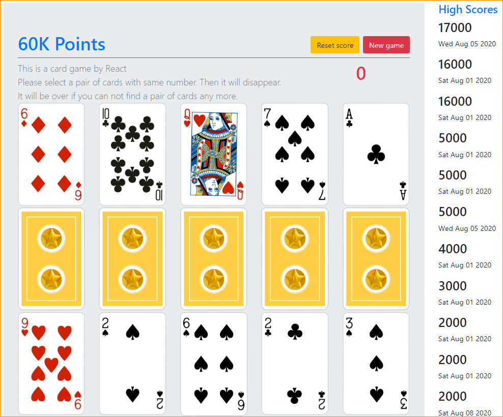

# Simple card game by ReactJS, created by create-react-app
<a href="https://yeahch.github.io/playing-card" target="blank"></a>

## Installation

```bash
$ yarn install
```

## Running the app
```bash
$ yarn start
```